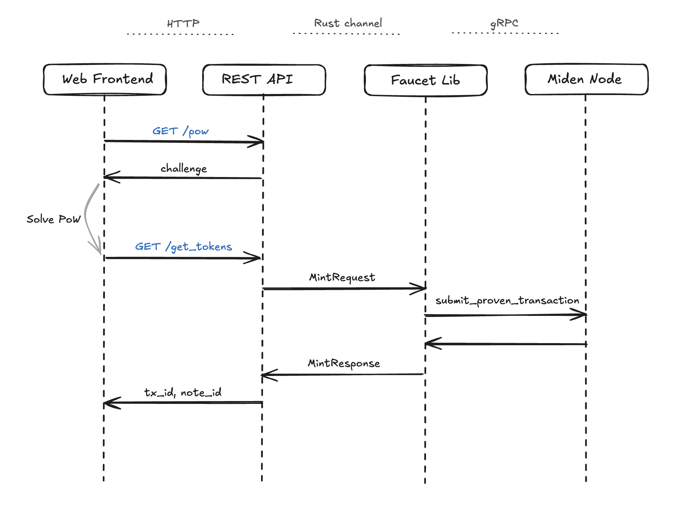

# Architecture Overview

This document provides a high-level overview of the Miden faucet architecture.

## System Architecture

The high-level structure of the project looks like follows:

    

## Core Components

### 1. Web Frontend
- **Technology**: Vanilla JavaScript, HTML5, CSS3
- **Purpose**: User interface for token requests
- **Features**: 
  - Token amount selection
  - Address input
  - Public/private note selection
  - PoW challenge solving
  - Request status display

### 2. REST API Server
- **Technology**: Axum HTTP framework
- **Purpose**: HTTP API endpoints for programmatic access
- **Features**:
   - Input parsing and validation
   - Handle account metadata

### 3. Faucet lib
- **Technology**: Rust library (`crates/faucet`)
- **Purpose**: Faucet core logic
- **Features**:
  - Account handling
  - Request batching
  - Notes creation
  - Token issuance tracking

### 4. PoW Rate Limiter
- **Technology**: Rust library (`crates/pow`)
- **Purpose**: Proof of Work rate limiter
- **Features**:
   - PoW challenges issuing, tracking and validation
   - Rate limiting

### 5. Miden Client
- **Purpose**: Connection with the Miden Node
- **Features**:
  - Transaction creation, execution, and submission

## Token request Flow

The basic HTTP requests for minting tokens involves `/pow` and `/get_tokens`. These are the entry points for the minting process. This is how the whole flow looks like:

    

### Detailed Flow

- **Request Initiation**
   - User submits token request (web or API)
   - System generates proof-of-work challenge
   - Challenge stored in cache with expiration

- **Challenge Resolution**
   - User solves computational challenge
   - Solution validated against challenge
   - Rate limiting enforced

- **Token Distribution**
   - Validated request processed
   - Token transaction created
   - Note generated (public or private)
   - Transaction is created, executed, and stored in the local database
   - Transaction is proven and submitted to Miden Node

- **Response**
   - Transaction ID and Note ID returned

## Why do we need a backend?

Could we not simply use the Miden Web SDK without a backend? The reason is security: if we were to use the Web SDK without a backend, the account's private key would need to be shared with the frontend. This would expose the private key to anyone, allowing them to potentially mint unlimited tokens and bypass all the rate limiting and throttling mechanisms.

The solution is to have a single backend running that receives and validates the minting requests and stores the account's private key needed to mint the tokens.

## Security Features

The faucet implements several security measures to prevent abuse:

- **Proof of Work requests**:
  - Users must complete a computational challenge before their request is processed.
  - The challenge difficulty increases with the load. The load is measured by the amount of challenges that were submitted but still haven't expired.
  - Each challenge is signed with a secret only known by the server. It should NOT be shared.
  - **Rate limiting**: if an account submitted a challenge, it can't submit another one until the previous one is expired. The challenge lifetime duration is fixed and set when running the faucet.
  - **API Keys**: the faucet is initialized with a set of API Keys that can be distributed to developers. The difficulty of the challenges requested using the API Key will increase only with the load of that key, it won't be influenced by the overall load of the faucet.

- **Requests batching**:
  - Maximum batch size: 100 requests
  - Requests are processed in batches to optimize performance
  - Failed requests within a batch are handled individually
